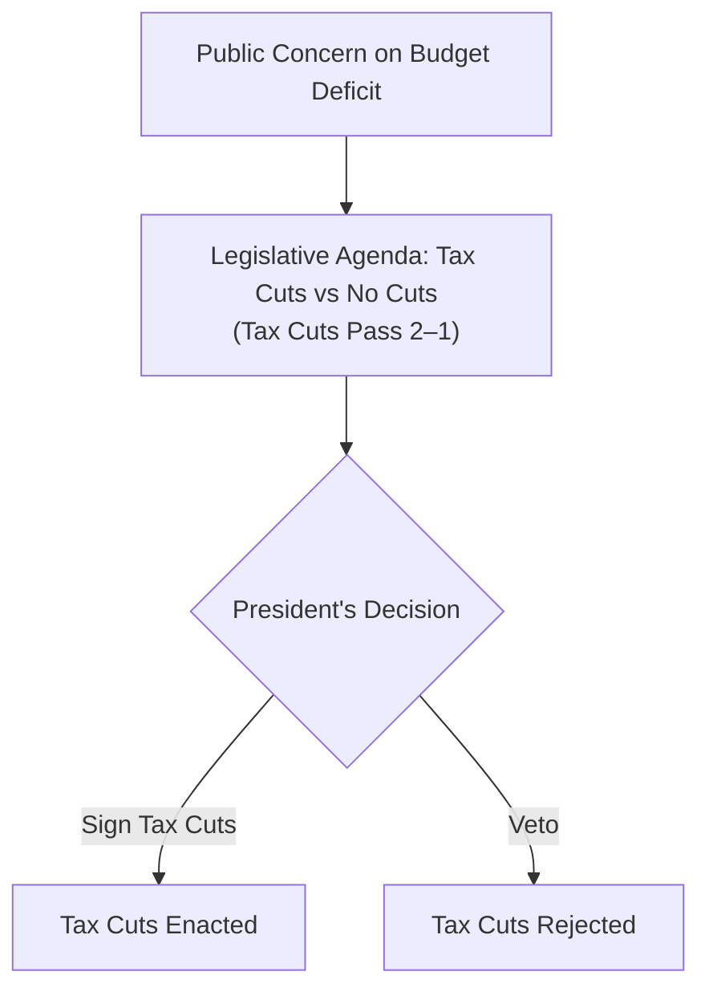

```mermaid
graph TD
    A[Public Concern on Budget Deficit] --> B["Legislative Agenda: Tax Cuts vs No Cuts\n(Tax Cuts Pass 2–1)"]
    B --> C{President's Decision}
    C -->|Sign Tax Cuts| D[Tax Cuts Enacted]
    C -->|Veto| E[Tax Cuts Rejected]


```
