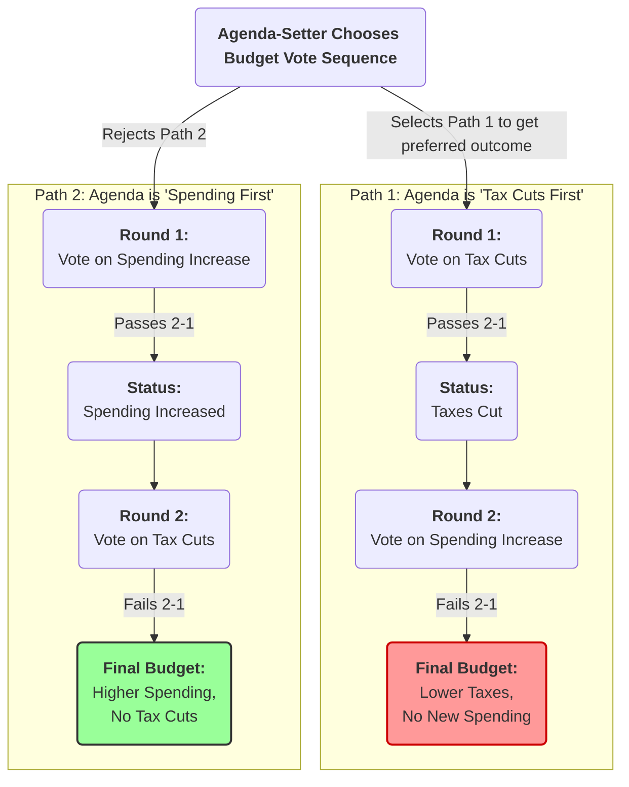

```mermaid
graph TD
    Start("<b>Agenda-Setter Chooses Budget Vote Sequence</b>")

    subgraph "Path 1: Agenda is 'Tax Cuts First'"
        direction LR
        N1("<b>Round 1:</b><br>Vote on Tax Cuts") -- "Passes 2-1" --> R1("<b>Status:</b><br>Taxes Cut")
        R1 --> N2("<b>Round 2:</b><br>Vote on Spending Increase")
        N2 -- "Fails 2-1" --> O1("<b>Final Budget:</b><br>Lower Taxes,<br>No New Spending")
    end
    
    subgraph "Path 2: Agenda is 'Spending First'"
        direction LR
        N3("<b>Round 1:</b><br>Vote on Spending Increase") -- "Passes 2-1" --> R2("<b>Status:</b><br>Spending Increased")
        R2 --> N4("<b>Round 2:</b><br>Vote on Tax Cuts")
        N4 -- "Fails 2-1" --> O2("<b>Final Budget:</b><br>Higher Spending,<br>No Tax Cuts")
    end

    Start -- "Selects Path 1 to get preferred outcome" --> N1
    Start -- "Rejects Path 2" --> N3

    style O1 fill:#f99,stroke:#c00,stroke-width:2px
    style O2 fill:#9f9,stroke:#333,stroke-width:2px

```
